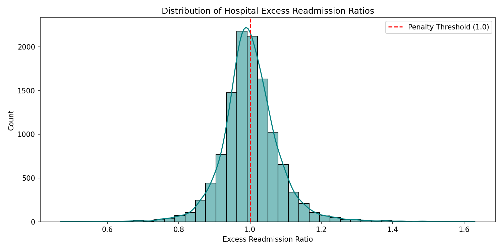
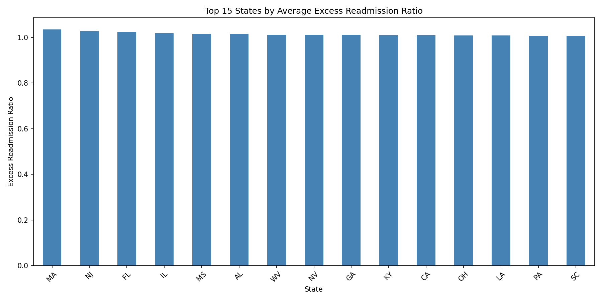
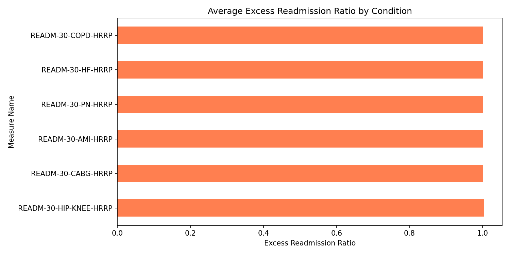

# 🏥 Hospital Readmissions Analysis


---

## 📌 Project Overview

This project analyzes CMS Hospital Readmissions Reduction Program (HRRP) data to identify patterns in hospital readmission rates across states, healthcare conditions, and medical facilities.

The project focuses on:

- Excess Readmission Ratios
- Medicare Penalty Risk
- State-wise Readmission Trends
- Condition-wise Healthcare Insights
- Data Cleaning & Visualization using Python

---

## 📊 Visualizations

### Distribution of Readmission Ratios



---

### State-wise Readmission Analysis



---

### Readmission Trends by Medical Condition



---

## 🛠️ Tech Stack

- Python
- Pandas
- NumPy
- Matplotlib
- Seaborn
- Jupyter Notebook

---

## 📂 Project Structure

```bash
hospital-readmissions-analysis/
│
├── data/
├── notebooks/
├── outputs/
├── visualizations/
├── README.md
└── requirements.txt
```

---

## 📈 Key Insights

- Certain states showed consistently higher excess readmission ratios.
- Some medical conditions had significantly larger penalty risks.
- Healthcare facilities with high excess ratios may face Medicare payment reductions.

---

## 🚀 Future Improvements

- Build interactive Tableau Dashboard
- Deploy Streamlit Healthcare Analytics App
- Add Predictive ML Model for readmission risk
- Integrate real-time healthcare datasets

---

## 👨‍💻 Author

Mimansa Nath  
Graduate Student — Information Technology & Management  
Healthcare Analytics | Data Engineering | AI